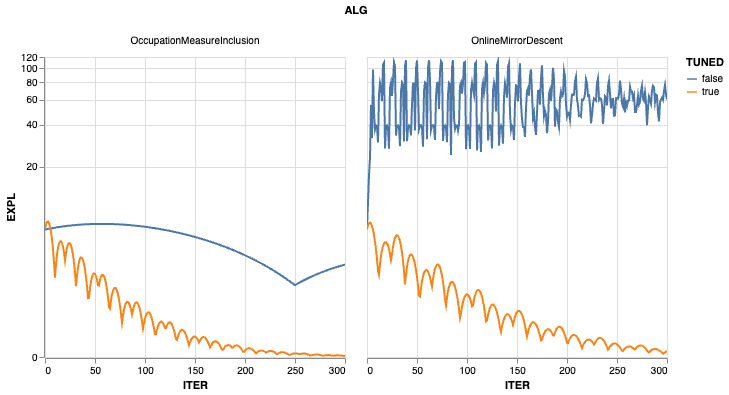

# Summary

Mean-field games (MFGs) provide scalable models for large-population strategic interactions. 
They approximate an $N$-player game by analyzing the limiting regime as $N \to \infty$, 
replacing explicit multi-agent interactions with the interaction between a representative agent 
and the population distribution [@lasry:2007]. It has been shown that the Nash equilibrium policy
of the mean-field game is an $\epsilon$-Nash equilibrium of the $N$-player game with $\epsilon = O(1 / \sqrt{N})$ 
[@huang:2006] and in practice even games with small $N$ on the order of tens can be well-approximated by MFGs 
[@guo:2019; @kizilkale:2019; @cabannes:2021]. Due to their tractability, MFG models have become widely used in 
applications such as digital advertising, high-frequency trading, dynamic pricing, transportation, and behavioral modeling.

Despite the rapid growth of the MFG literature, however, researchers and practitioners lack a unified, 
open-source software package for defining and solving their own MFG problems. 

**MFGLib** is an open-source Python library that addresses this gap by providing:

* A modular and extensible API for defining arbitrary discrete-time finite-state MFGs
* Implementations of state-of-the-art algorithms for computing (approximate) Nash equilibria
* A collection of ten customizable benchmark environments drawn from the literature
* Tight integration with **Optuna** [@akiba:2019] to provide automatic hyperparameter selection
* Clear documentation and examples, facilitating both research and industry use

The library is implemented in Python, maintained on GitHub, and can be installed via `pip install mfglib`. Full 
documentation, tutorials, and example notebooks are available at https://mfglib.readthedocs.io/en/latest/.

# Statement of need

Large population games are ubiquitous in real-world problems. As the number of players in the game grows, however, the 
computational complexity grows exponentially, and it becomes notoriously hard to solve such problems.

Various libraries have been developed for $N$-player games, such as **QuantEcon** [@batista:2024], **Nashpy**
[@knight:2018] and **ilqgames** [@fridovich:2020]. In contrast, only very few tools focus on MFGs 
and are mainly for experimental and internal use and hence not suitable for general users with their own customized 
environments and problems.

Existing tools fall short for one of two reasons:

1. Current $N$-player frameworks such as Nashpy [@knight:2018] and QuantEcon [@batista:2024] are restricted to 
small $N$ and lack the mean-field approximations necessary to handle the complexity of large-scale games.

2. MFG-specific repositories such as **gmfg-learning** [@cui:2022] or **entropic-mfg** [@benamou:2019] are designed to 
reproduce experiments from individual publications. They lack reusable abstractions, extensible environment definitions,
and well-documented algorithm implementations.

Among the very few existing MFG libraries, **OpenSpiel** is the closest to MFGLib. OpenSpiel includes an MFG module, 
but it lacks customizability and a user-friendly API for general users. According to its documentation, the MFG code 
is experimental and recommended only for internal use.

As a result, researchers re-implement environments, MFG solvers, and population dynamics from scratch -- an
error-prone and time-consuming process that hinders reproducibility and comparison of new algorithms.

**MFGLib addresses this need as the first general-purpose, customizable, and well-documented MFG library.**
It lowers the barrier to entry for new researchers, enables rapid experimentation, and offers practitioners
a way to prototype MFG-based models without requiring deep expertise in game theory or optimal control.

# Key Features

## User-Friendly Environment Creation

Users can define custom MFG environments by providing reward functions, transition functions, and basic 
problem parameters (time horizon, state/action space sizes, initial distribution). The reward and transition 
functions are simple callables that map time and population distribution to tensors, allowing users to create 
environments with minimal code while maintaining mathematical clarity.

## Pre-Implemented Algorithms

MFGLib implements several widely used algorithms, including **Online Mirror Descent** [@perolat:2021], 
**Fictitious Play** [@perrin:2020], **MFOMO** [@guo:2023], **MFOMI** [@hu:2024], and **Prior Descent** [@cui:2021]. 
These algorithms encompass many other existing methods as special cases, such as fixed point iteration and **GMF-V** 
[@guo:2019]. The unified solver interface returns policy iterates, exploitability scores (which evaluate 
closeness to Nash equilibrium), and cumulative runtimes, with optional real-time logging to monitor convergence.

## Automatic Hyperparameter Tuning

Every algorithm requires hyperparameters that can drastically influence convergence properties. MFGLib provides 
a built-in tuner based on Optuna [@akiba:2019] to automatically select optimal hyperparameters. The tuner can 
optimize across single instances or environment suites with multiple policy initializations and customizable 
metrics (e.g., shifted geometric mean of exploitability). Users can also implement their own metrics with 
minimal effort.

## High-Dimensional Representation

MFGLib uses **PyTorch** tensors to represent policies, mean-fields, and rewards while preserving the original 
structure of state and action spaces. Rather than flattening high-dimensional spaces into one-dimensional 
representations, the library maintains their natural structure, providing higher interpretability and more 
flexible user interactions.

# Example

We demonstrate the usage of our library with a brief example: a mean-field variant of Rock-Paper-Scissors 
introduced by @cui:2021. Each agent chooses rock, paper or scissors, and receives a reward 
proportional to twice the number of beaten agents minus the number of agents that beat them. 

Formally, the state and action spaces are $\mathcal{S} = \{ 0, R, P, S \}$ and $\mathcal{A} = \mathcal{S} \setminus \{ 0 \}$,
respectively. The initial state distribution is fixed at $\mu_0(0) = 1$, and the game occurs over timesteps 
$\mathcal{T} = \{ 0, 1, \dots, T \}$. Agent rewards are specified by
\begin{align*}
r(R, a, \mu_t) &= 2 \cdot \mu_t(S) - 1 \cdot \mu_t(P) \\
r(P, a, \mu_t) &= 4 \cdot \mu_t(R) - 2 \cdot \mu_t(S) \\
r(S, a, \mu_t) &= 6 \cdot \mu_t(P) - 3 \cdot \mu_t(R)
\end{align*}
The transition function allows agents to pick their next state directly and independently of the population; that is,
for all $s, s' \in \mathcal{S}$ and $a \in \mathcal{A}$,
$$\Pr(s_{t + 1} = s' \mid s_t = s, a_t = a) = \mathbf{1}_{\{ s' \}}(a)$$

We tune two algorithms -- Online Mirror Descent [@perolat:2021] and Occupation Measure Inclusion [@hu:2024] -- on 
this environment. 

```python
from mfglib.env import Environment
from mfglib.alg import OnlineMirrorDescent, OccupationMeasureInclusion
from mfglib.tuning import GeometricMean

solve_kwargs = {"atol": None, "rtol": None, "max_iter": 300}

env = Environment.rock_paper_scissors(T=20)

omd_orig = OnlineMirrorDescent()
omi_orig = OccupationMeasureInclusion()

# Compute exploitability traces for untuned algorithms
_, omd_expls_orig, _ = omd_orig.solve(env, **solve_kwargs)
_, omi_expls_orig, _ = omi_orig.solve(env, **solve_kwargs)

metric = GeometricMean(shift=0.1)

# Optimize algorithms over hyperparameters
N_TRIALS = 50
omd_study = omd_orig.tune(
    metric=metric, envs=[env], n_trials=N_TRIALS, solve_kwargs=solve_kwargs
)
omi_study = omi_orig.tune(
    metric=metric, envs=[env], n_trials=N_TRIALS, solve_kwargs=solve_kwargs
)

# Initialize new algorithms objects from the tuning results
omd_tuned = omd_orig.from_study(omd_study)
omi_tuned = omi_orig.from_study(omi_study)

# Compute exploitability traces for tuned algorithms
_, omd_expls_tuned, _ = omd_tuned.solve(env, **solve_kwargs)
_, omi_expls_tuned, _ = omi_tuned.solve(env, **solve_kwargs)
```

Plotting the exploitability scores of the two algorithms, before and after tuning, we observe that tuning significantly 
improves performance by achieving faster exploitability reduction.



# Impact and Community Engagement

The library has developed an active user community, including researchers and practitioners who have already used 
MFGLib in their work, contributed issues and pull requests on GitHub, and engaged with the tutorials and documentation. 
This activity demonstrates that the package is both useful to the community and actively maintained. Since its release, 
MFGLib has supported the development of several cutting-edge algorithms for MFGs, such as MF-OMO [@guo:2023], 
MF-OMI [@hu:2024], and MESOB [@guo:2023:mesob], as well as new models including MFG-MCDM [@becherer:2025] 
and ($\alpha$, $\beta$)-symmetric games [@yardim:2024]. It has also been used internally by Amazon Advertising for both research 
and production purposes. We believe it will continue to serve as an important building block for researchers in both 
academia and industry.

# Acknowledgments

We thank the Amazon research teams for feedback and stress-testing the library in production settings. The authors would 
especially like to thank Sareh Nabi, Rabih Salhab, and Lihong Li of Amazon, Xiaoyang Liu of Columbia University, and 
Zhaoran Wang of Northwestern University for their valuable comments.

# References
